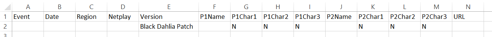
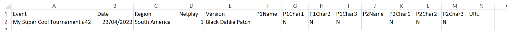
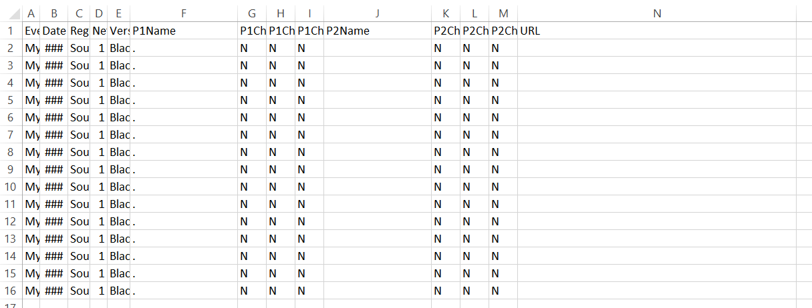
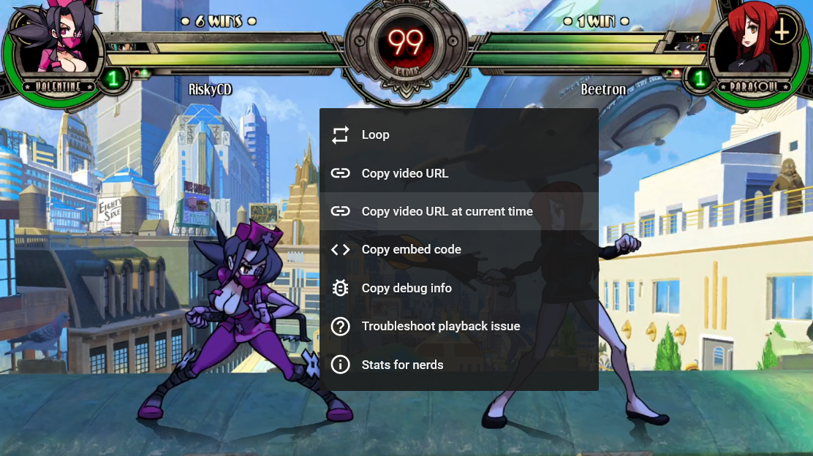
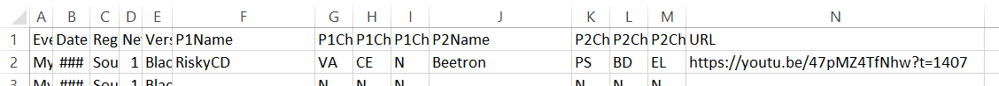

# How to contribute VODs/timestamps to Slowtrain

This is a quick run-down of how to submit a new VOD to Slowtrain. You'll be
filling out a relatively simple csv file, and then sending it to me (SeaJay).

## Prerequisites

* Must be a publicly-viewable YouTube video (unlisted is OK).
* It must feature Skullgirls gameplay between two human players.
* PC/Console only (not Mobile).

Other than that, there are very little restrictions:

* Any geographical region is OK.
* Any skill level is OK. 
* Casual matches are OK.
* Outdated versions are OK, but it's good to specify this in the YouTube title
  or description.
* You don't have to be the uploader/owner. Slowtrain merely links to videos and
  doesn't [freeboot](https://www.urbandictionary.com/define.php?term=Freebooting),
  nor does it run its own ads or any kind of monetisation. If it's someone else's
  unlisted video, you may want to ask the person if they're OK with it being linked to.

## Easy mode: when the video already has timestamps

If your youtube video already has timestamps in its description like:

```
0:00:00 Player (Char/Char/Char) vs Player (Char/Char/Char)
0:08:51 Player (Char/Char/Char) vs Player (Char/Char/Char)
0:28:12 Player (Char/Char/Char) vs Player (Char/Char/Char)
...
```

you can copy that into [this tool](https://github.com/hugh-braico/yt-timestamp-to-twb),
and it will fill out the file for you! Then all you need to do is send
the file over (see "Sending the file to SeaJay" below).

If it only has players but no teams, you'll need to either add teams to the timestamps
before running the generator, or fill in the teams in the resulting file manually
(read on for how to do that).

If you prefer, you could do the entire timestamping process through this tool even if
timestamps don't already exist, but it's slower than editing a spreadsheet directly.
Would only recommend if you really hate using Excel.

## Manual method: filling out a csv file

Download and save the [template csv file](https://github.com/hugh-braico/slowtrainroll.in/blob/master/docs/twb_csv_template.csv).

A csv file (Comma-Separated Values) is basically just a very simple plaintext
representation of a spreadsheet/table. You can edit this in plaintext if you
want, but it's much nicer to open it in Excel or your spreadsheet program of
choice. I'll be using Excel here. When opening the template in Excel, it should
look like this:



The first row is just the table header, and each row below it represents a set
between two players. Right now there's only one mostly-empty row representing a
set.

The first order of business is to fill out some basic info about the event:

* **Event Name:** The name of the event the set is being played in.
	* Use "Casual Matches" if it's not any particular event or tournament.
	* If the event already exists in Slowtrain, go by that convention.
	* Kumites are usually called "Kumite, PlayerName". If editing in plaintext,
	  you will need to explicitly add double quotes because it contains a comma.
* **Date:** `DD/MM/YYYY` or `YYYY-MM-DD` format only (sorry Americans).
* **Region**: one of "Europe", "Asia", "North America", "South America", or
  "Oceania".
  * If you're in a region not well-described by any of these, please get in
    touch with me.
* **Version**: I've prefilled this with "2024 Balance Patch" for you, but if
  it's an older vod, you may want "Marie Patch", and so on.
  * [Full version list from source code if you need it](https://github.com/hugh-braico/slowtrainroll.in/blob/master/viewer/models.py#L39)

Once you've done that, it should look something like this:



If the VOD contains *multiple sets*, copy this row a bunch of times, and then
optionally adjust the column widths a bit to make the rest easier to edit.



Now we can start adding sets! Navigate to the roundstart of the first game of
the first set in the VOD, right click the video, and copy the timestamped URL
like so:



Paste that into the URL field, then fill out the player names and characters for
the two teams.

About names: if a player is already listed on the site, use that name.
Otherwise, use your best judgement for the name they're best known as, or want
to be known as.

For characters, use the *abbreviated name*:

| Character    | Abbreviation | Character    | Abbreviation |
|--------------|--------------|--------------|--------------|
| Annie        | AN           | Beowulf      | BW           |
| Big Band     | BB           | Black Dahlia | BD           |
| Cerebella    | CE           | Double       | DB           |
| Eliza        | EL           | Filia        | FI           |
| Fukua        | FU           | Marie        | MA           |
| Ms. Fortune  | MF           | Painwheel    | PW           |
| Parasoul     | PS           | Peacock      | PC           |
| Robo-Fortune | RF           | Squigly      | SQ           |
| Umbrella     | UM           | Valentine    | VA           |

Some of these slip people up (especially Parasoul/PS, Peacock/PC, Double/DB, and
Beowulf/BW). Once you know them all though, it saves on a ton of typing time. 
Any unfilled character slots should just be left as N, eg. Filia/Band duo is
FI/BB/N.

Once you've done that, your row is now finished:



Then move onto the next row for the next set in the video, and so on until
you've done! Save the file with whatever name you like (make sure it's still
a .csv, Excel likes to ask you to make it an .xlsx but don't fall for its
tricks).

## Sending the file to SeaJay

You can send me the file through any of these avenues:

* Send me a Discord DM: `seajay4444`
* Send me an email at `admin at slowtrainroll dot in` (email obfuscated slightly
  to discourage scrapers)
* Send me a Twitter DM: [@SeaJay4444](https://twitter.com/SeaJay4444)

Then I should have the file uploaded to the site within a week or so.

## A note about automated timestamping

Does the vod ALREADY HAVE TIMESTAMPS IN THE DESCRIPTION?
Check out [this tool](https://github.com/hugh-braico/yt-timestamp-to-twb)!
(You could do the entire timestamping process through this tool even
if timestamps don't already exist, but it's slower than editing a
spreadsheet directly)

I have an [automated timestamping program](https://github.com/hugh-braico/skug-stamper)
in the works and it's what I currently use to timestamp SGOCE's vods, but it's
kind of a lot for other people to pick up and use right now. Making it more
accessible is still a work in progress.

If you're the tinkering type, the latest version is in the
[gui branch](https://github.com/hugh-braico/skug-stamper/tree/gui).
